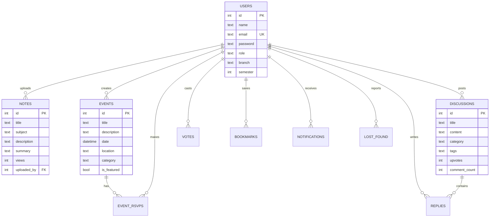

<p align="center">
  
</p>

<h1 align="center">🎓 CampusFlow</h1>
<p align="center">
  <strong>AI-Powered College Community Platform</strong>
</p>
<p align="center">
  Share notes • Discover events • Join discussions • Find lost items — all powered by Google Gemini AI
</p>

<p align="center">
  
  
  
  
  
  
</p>

---

## ✨ Features

### 📚 Smart Notes
- Upload, browse, and filter academic notes by subject/semester
- **AI-powered summarization** — get bullet-point summaries of any note with one click
- Featured notes, view counts, and uploader profiles

### 🎉 Events Hub  
- Discover campus events with category filters (Workshop, Conference, Seminar, Social, Career)
- **RSVP system** — mark as "Going" or "Interested"
- **AI description improvement** for event creators
- Featured event showcase with date badges

### 🔍 Lost & Found
- Report lost or found items with status tracking (Lost / Found / Claimed)
- **AI description generation** — describe items roughly, let AI write a polished description
- Location tagging and status filtering

### 💬 Discussion Forum
- Reddit-style discussion threads with **upvote/downvote** system
- Three-column layout: navigation, feed, trending sidebar
- Category organization (Academic, Clubs, General)
- **AI "Explain this answer"** — get deeper explanations of any reply
- Campus Karma gamification system

### 👤 Profile & Settings
- User profile with activity stats (notes shared, discussions, total views)
- **Dark/Light mode toggle** with system persistence
- Tabbed view of user's own notes and posts

### 🔔 Notifications
- Real-time notification dropdown with unread badges
- Mark individual or all notifications as read
- Deep-link to relevant content

### 🔐 Authentication
- Secure JWT-based authentication with bcrypt password hashing
- Protected routes with session persistence
- One-click demo account login

---

## 🏗️ Architecture

```
┌─────────────────────────────────────────────────────┐
│                    CLIENT (React + Vite)             │
│                   http://localhost:5173              │
│                                                     │
│  ┌──────────┐  ┌──────────┐  ┌──────────────────┐  │
│  │  Pages   │  │Components│  │    Context        │  │
│  │          │  │          │  │                   │  │
│  │ • Home   │  │ • Navbar │  │ • AuthContext     │  │
│  │ • Login  │  │ • Bottom │  │ • ThemeContext    │  │
│  │ • Notes  │  │   Nav    │  │                   │  │
│  │ • Events │  │ • Layout │  └──────────────────┘  │
│  │ • Forum  │  │          │                         │
│  │ • L&F    │  └──────────┘  ┌──────────────────┐  │
│  │ • Profile│                │   Services/API    │  │
│  └──────────┘                │   (fetch wrapper) │  │
│                              └────────┬─────────┘  │
└───────────────────────────────────────┼─────────────┘
                                        │ /api proxy
                                        ▼
┌─────────────────────────────────────────────────────┐
│                  SERVER (Express.js)                 │
│                  http://localhost:3001               │
│                                                     │
│  ┌─────────────────────────────────────────────┐    │
│  │              REST API Routes                 │    │
│  │                                              │    │
│  │  /api/auth     → Register, Login, Me         │    │
│  │  /api/notes    → CRUD + AI Summarize         │    │
│  │  /api/events   → CRUD + RSVP + AI Improve    │    │
│  │  /api/lostfound→ CRUD + AI Description       │    │
│  │  /api/forum    → CRUD + Vote + AI Explain    │    │
│  │  /api/notifications → Get + Mark Read        │    │
│  └──────────┬──────────────────┬────────────────┘    │
│             │                  │                     │
│  ┌──────────▼──────┐  ┌───────▼──────────────┐      │
│  │   Middleware     │  │   Gemini AI Service  │      │
│  │  • JWT Auth      │  │  • summarizeNotes()  │      │
│  │  • Optional Auth │  │  • improveDesc()     │      │
│  └──────────┬──────┘  │  • generateDesc()    │      │
│             │          │  • explainAnswer()   │      │
│  ┌──────────▼──────┐  └───────┬──────────────┘      │
│  │   SQLite DB     │          │                      │
│  │  (better-sqlite3)│         ▼                      │
│  │                  │  ┌──────────────────┐          │
│  │  10 tables:      │  │  Google Gemini   │          │
│  │  users, notes,   │  │  API (2.0 Flash) │          │
│  │  events, rsvps,  │  └──────────────────┘          │
│  │  lost_found,     │                                │
│  │  discussions,    │       ┌──────────────┐         │
│  │  replies, votes, │       │  File Upload │         │
│  │  bookmarks,      │       │  (Multer)    │         │
│  │  notifications   │       └──────────────┘         │
│  └─────────────────┘                                 │
└─────────────────────────────────────────────────────┘
```

---

## 🛠️ Tech Stack

| Layer | Technology | Version | Purpose |
|-------|-----------|---------|---------|
| **Frontend** | React | 19.2 | UI component library |
| **Bundler** | Vite | 8.0 | Fast dev server with HMR |
| **Routing** | React Router | 7.14 | Client-side SPA routing |
| **Icons** | Lucide React | 1.7 | Consistent icon set |
| **Styling** | Vanilla CSS | — | Custom design system with CSS variables |
| **Font** | Inter | — | Modern typography via Google Fonts |
| **Backend** | Express.js | 5.2 | REST API server |
| **Database** | SQLite | — | File-based relational database |
| **DB Driver** | better-sqlite3 | 12.8 | Synchronous SQLite bindings |
| **Auth** | JWT + bcrypt | — | Token-based auth with password hashing |
| **AI** | Google Gemini | 2.0 Flash | Note summaries, descriptions, explanations |
| **Upload** | Multer | 2.1 | File upload middleware |

---

## 📁 Project Structure

```
Campus_Flow/
├── client/                          # React Frontend (Vite)
│   ├── public/                      # Static assets
│   ├── src/
│   │   ├── components/
│   │   │   └── layout/              # Navbar, BottomNav, Layout
│   │   ├── context/                 # AuthContext, ThemeContext
│   │   ├── pages/                   # All page components + CSS
│   │   │   ├── Home.jsx / .css
│   │   │   ├── Login.jsx / .css
│   │   │   ├── Register.jsx
│   │   │   ├── Notes.jsx / .css
│   │   │   ├── Events.jsx / .css
│   │   │   ├── LostFound.jsx / .css
│   │   │   ├── Forum.jsx / .css
│   │   │   ├── ForumPost.jsx / .css
│   │   │   └── Profile.jsx / .css
│   │   ├── services/                # API service layer
│   │   ├── utils/                   # Helper functions
│   │   ├── index.css                # Design system (400+ lines)
│   │   ├── App.jsx                  # Routes & providers
│   │   └── main.jsx                 # Entry point
│   ├── index.html
│   ├── vite.config.js               # Dev server + API proxy
│   └── package.json
│
├── server/                          # Express Backend
│   ├── config/
│   │   └── database.js              # SQLite schema + seed data
│   ├── middleware/
│   │   └── auth.js                  # JWT middleware
│   ├── routes/
│   │   ├── auth.js                  # Auth endpoints
│   │   ├── notes.js                 # Notes CRUD + AI
│   │   ├── events.js                # Events CRUD + RSVP
│   │   ├── lostfound.js             # Lost & Found CRUD + AI
│   │   ├── forum.js                 # Forum CRUD + votes + AI
│   │   └── notifications.js         # Notifications
│   ├── services/
│   │   └── gemini.js                # Gemini API integration
│   ├── uploads/                     # Uploaded files
│   ├── server.js                    # Entry point
│   └── package.json
│
├── .gitignore
└── README.md
```

---

## 🗄️ Database Schema



---

## 🚀 Getting Started

### Prerequisites
- **Node.js** v18+ 
- **npm** v9+
- **Google Gemini API Key** (optional — AI features degrade gracefully without it)

### Installation

```bash
# 1. Clone the repository
git clone https://github.com/shashwat-p123/Campus_Flow.git
cd Campus_Flow

# 2. Install server dependencies
cd server
npm install

# 3. Create environment file
cp .env.example .env
# Edit .env and add your GEMINI_API_KEY

# 4. Install client dependencies
cd ../client
npm install
```

### Running the Application

```bash
# Terminal 1: Start the backend
cd server
node server.js
# → API running on http://localhost:3001

# Terminal 2: Start the frontend
cd client
npm run dev
# → App running on http://localhost:5173
```

### Demo Account
> **Email:** `alex@university.edu`  
> **Password:** `password123`  
> Or click **"Sign in with Demo Account"** on the login page

---

## 🔑 Environment Variables

Create a `server/.env` file:

```env
PORT=3001
JWT_SECRET=your_jwt_secret_key
GEMINI_API_KEY=your_google_gemini_api_key
```

---

## 🤖 AI Features (Powered by Gemini 2.0 Flash)

| Feature | Location | What it does |
|---------|----------|-------------|
| **Summarize Notes** | Notes → Note Detail → "Summarize with AI" | Generates bullet-point summaries with key topics |
| **Improve Description** | Events → Edit Event | Polishes event descriptions to be more engaging |
| **Generate Description** | Lost & Found → Report Item → "Generate with AI" | Turns rough input into clear item descriptions |
| **Explain Answer** | Forum → Post → Reply → "Explain this answer" | Provides detailed explanations of forum replies |

---

## 🎨 Design System

The app uses a custom CSS design system with:

- **Color Palette**: Deep indigo primary (`#5B4FE6`), mint accent (`#2DD4A8`)
- **Dark Mode**: Full dark theme with CSS custom properties
- **Typography**: Inter font with 5 weight variations
- **Glassmorphism**: Frosted glass effects with backdrop-filter
- **Animations**: fadeIn, slideUp, shimmer, pulse, scaleIn, bounceIn
- **Components**: Cards, badges, buttons, inputs, modals, tooltips, toasts
- **Responsive**: Mobile-first with breakpoints at 768px and 1024px

---

## 📱 Responsive Design

| Viewport | Layout |
|----------|--------|
| **Desktop** (1024px+) | Full layout with sidebars, multi-column grids |
| **Tablet** (768px–1024px) | Collapsed sidebars, simplified grids |
| **Mobile** (<768px) | Single column, bottom navigation bar, hidden desktop nav |

---

## 🙏 Acknowledgments

- [React](https://react.dev/) — UI library
- [Vite](https://vite.dev/) — Build tool
- [Express](https://expressjs.com/) — Backend framework
- [Lucide](https://lucide.dev/) — Icon library
- [Google Gemini](https://ai.google.dev/) — AI integration
- [Inter Font](https://fonts.google.com/specimen/Inter) — Typography

---

<p align="center">
  Built with 💜 by <a href="https://github.com/shashwat-p123">Shashwat</a>
</p>
